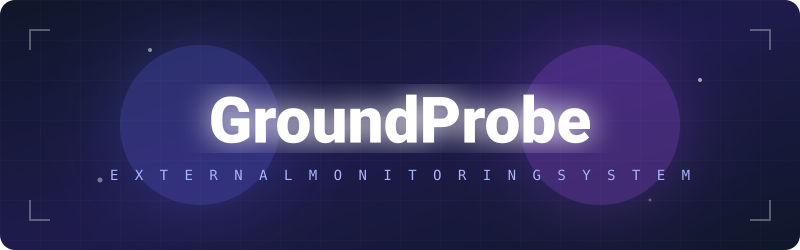
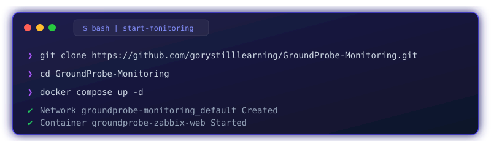

<div align="center">



### Premium Dark Glass Custom Zabbix Monitoring

[](https://www.docker.com/)
[](https://www.zabbix.com/)
[](https://www.linux.org/)
[](https://www.apple.com/macos/)
[](https://www.microsoft.com/windows/)

**GroundProbe-Monitoring** is an automated, single-click deployment package for Zabbix Server 6.4, pre-configured with a highly customized Premium Dark Glass theme and corporate branding for GroundProbe Slope Stability Radar (SSR) Wireless Communications.
</div>

---

<div align="center">
  
</div>

## 🚀 Installation Guide

### Prerequisites
1. Ensure **Docker Desktop** is installed and running.

### Quick Start
Simply run the following command in the directory containing the `docker-compose.yml` file:
```bash
docker compose up -d
```
That's it! The custom CSS and logos are already baked into the multi-architecture Docker image.

## 🌐 Dashboard Access

Once the installation is complete, open your web browser and navigate to:
<h3 align="center">👉 <a href="http://localhost:8080">http://localhost:8080</a> 👈</h3>

> **Note:** Please ensure that port **8080** is available on your local machine before running the setup.

### Default Credentials
- **Username:** `Admin` *(Case-sensitive)*
- **Password:** `zabbix`

## 🎨 Features
- **One-Click Deploy:** Fully automated Docker compose setup.
- **Glassmorphism UI:** Custom-built CSS overriding Zabbix's default blue theme with a modern, glowing glass aesthetic.
- **Brand Integration:** Replaces default Zabbix branding with GroundProbe logos and colors.
- **Smooth Animations:** Hover effects, flyout menus, and custom scrollbars optimized for UI/UX.

---
<div align="center">
  <sub>Built with ❤️ for GroundProbe</sub>
</div>
